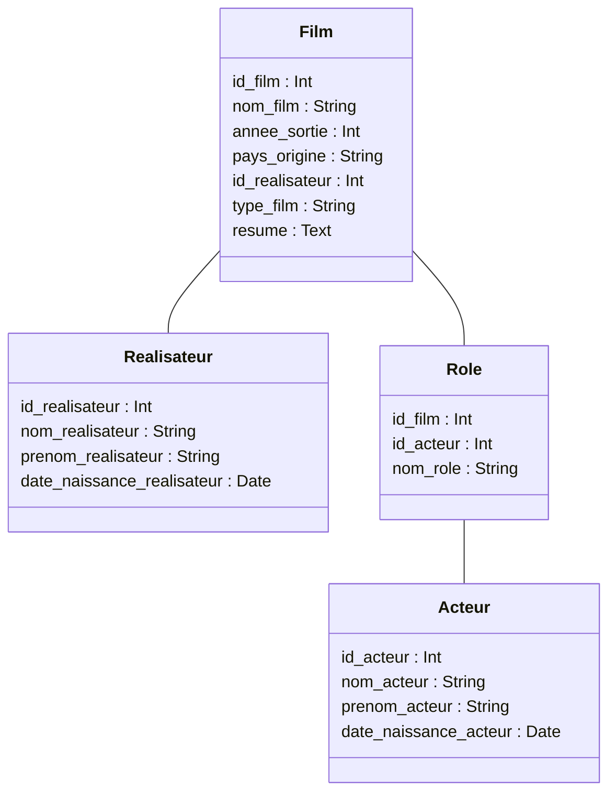

# NoSQL Course

## Exo

### TP 1

Mettez au point un schéma relationnel pour stocker des données
de films qui comprendraient :

- le nom du film
- l'année
- le pays
- le réalisateur (nom, prénom, date de naissance)
- les acteurs (nom, prénom, date de naissance, rôle)
- le de film
- le résumé

